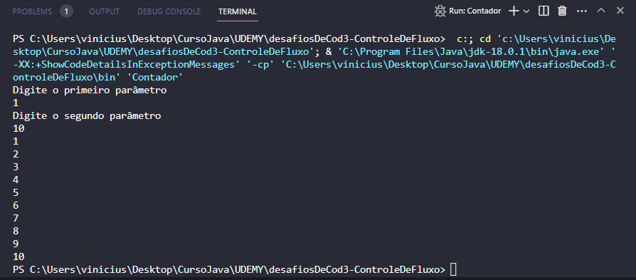
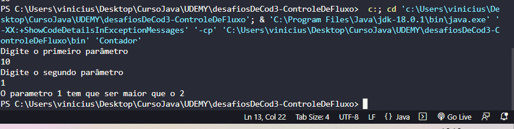

# PROJETO
DESAFIO DE COD DA DIO SOBRE IMPLEMENTAÇÃO

# IMG TERMINAL
## COM PARAMETROS 1 E 10

## COM PARAMETROS 10 E 1

## Dependency Management

The `JAVA PROJECTS` view allows you to manage your dependencies. More details can be found [here](https://github.com/microsoft/vscode-java-dependency#manage-dependencies).
